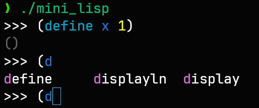

# Additional Features of My Interpreter

### Garbage Collection

In the implementation of the document, there is a memory leak with lisp lambda expressions. To fix this, we can use garbage collection instead of `std::shared_ptr` in C++. We store all values and environment in a garbage collector, and run a mark and sweep algorithm to collect unused memory.

### REPL with Syntax Highlighting and Autocomplete



For better user experience, we add syntax highlighting and autocomplete features to the REPL. We use an open source library called [replxx](https://github.com/AmokHuginnsson/replxx) for this feature.

### Write and Load Mini Lisp Module

Most languages allow users to write their code in separated files. We add the similar feature to our interpreter by adding a `require` special form. For example, we can write a module named `add.scm`:

```lisp
(define (add x y) (+ x y))
```

Then we can load this module in other files by using the `require` special form:

```lisp
(require "add")
(print (add 1 2))
```

The interpreter will search for the module according to environment variable `LISP_PATH` and also search in the current directory.

### Write and Load C++ Extensions

As our interpreter is much slower compared to other languages like C and C++, it may take a lot of time for compute massive program. To address this issue, we add an api for writing and loading C++ extensions. We provide two examples in `examples/cpp_extension`. Just like Python, we can use the `require` special form to load C++ extensions, for example:

```lisp
(require "quick_sort")
(define sample '(12 71 2 15 29 82 87 8 18 66 81 25 63 97 40 3 93 58 53 31 47))
(print (quicksort sample))
```

The interpreter will try to find `libquick_sort.so` in the current directory or environment variable `LISP_PATH`. As Windows is quite complex for implementing this feature, we currently only support Unix-like system and test on Linux.

### Error Handling with Source Code Location Information

When an error occurs, the interpreter will print the source code location information, including the file name, line number and column. This helps users to quickly locate the error in their code.
